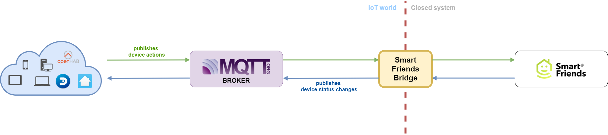
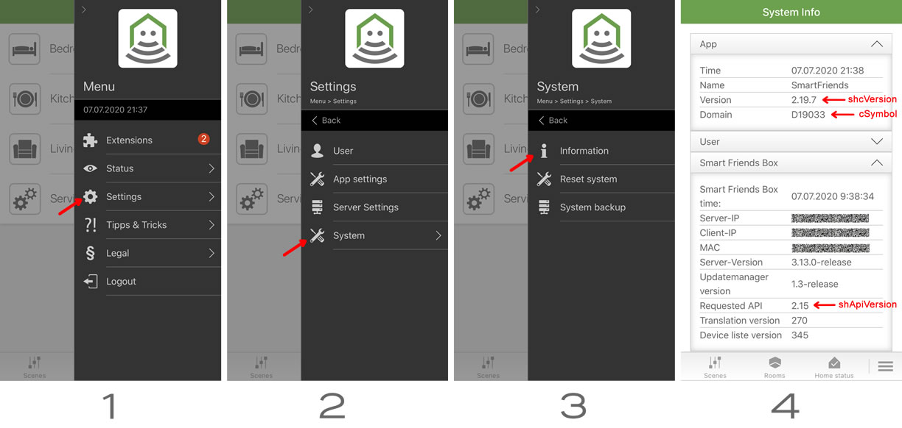
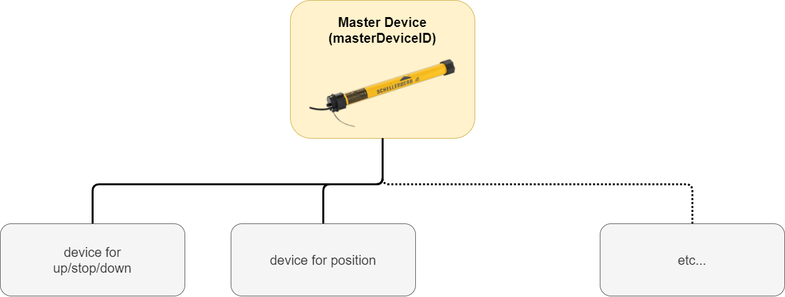

# Smart Friends Bridge

## Description

This module creates a link between a [Smart Friends Box](https://smart-friends.com/) and a MQTT broker.

This allows you to control all your Smart Friends devices (Schellenberg, ABUS, Paulmann, Steinel, etc...) via MQTT protocol.



This Add-On uses the Schellenberg API developed by [LoPablo](https://github.com/LoPablo).

Tests have been carried out on:

- Schellenberg SH1-Box
- Smart Friends Box

## How to use the Bridge?

### Prepare the MQTT Broker

Before going any further, a MQTT broker must be up and running, as it is required.

Detailled information on how to setup MQTT on Hassio is available [here](https://www.home-assistant.io/docs/mqtt/broker/).


### Configuration and first start

- Install the Smart Friends Bridge

  ```bash
  npm install https://github.com/airthusiast/smart-friends-bridge.git
  ```

- Copy the provided the configuration sample (config.json.sample) and change it accordingly:

  ```yaml
  { "connexion": {
        "host": "192.168.1.3", #-------> IP of your Schellenberg SH1 Box / Smart Friends Box
        "port": 4300, #----------------> Port of the box, generally 4300/tcp
        "username": "myuser", #--------> Username
        "password": "mysecret", #------> Password
      }, "advanced": {
        "enableDebug": true, #---------> Enable or disable debug mode
        "cSymbol": "D19033", #---------> Extra param 1
        "cSymbolAddon": "i", #---------> Extra param 2
        "shcVersion": "2.19.7", #------> Extra param 3
        "shApiVersion": "2.15", #------> Extra param 4
      },
      "mqtt": {
        "url": "mqtt://broker.url", #--> MQTT URL
        "username": "myusername", #----> MQTT Broker username
        "password": "mypassword" #-----> MQTT Broker password
      },
      "web": {
        "port": 8080 #-------------------> Embedded web server listening port, exposing device list
      }
  }
  ```

  **Extra API parameters**:
  In order to find these values, simply open the Smart Friends App (or Schellenberg app) and go to the information page as illustrated:

  

- Now start the Smart Friends Bridge:
  ```bash
  node smart-friends-bridge myconfig.json # myconfig.json is your personal config file created above
  ```

### Collect devices ID's

Device ID's **are important**, they will be used to interact with the devices.

Once Smart Friends Bridge is started, the complete list of devices will available on a simple web page:

> http://localhost:8080

The embedded web server will be listening on the configured port: ```config.web.port```

Optional: If debug mode is enabled, the device list will be printed in the console as well: 

```bash
Device found:
> deviceID:          3079 #-------------> Example: Device ID of a roller shutter
> masterDeviceID  :  5243
> masterDeviceName:  Roller Shutter 1
> deviceName:        Motor
> deviceDesignation: Rohrmotor PREMIUM
Device found:
> deviceID:          36221 #-------------> Example: Device ID of a second roller shutter
> masterDeviceID  :  2411
> masterDeviceName:  Roller Shutter 2
> deviceName:        Motor
> deviceDesignation: Rohrmotor PREMIUM
...
...
...
```
Write them down, you will need them in the next step!

##### Information about devices IDs
A physical device can have multiple devices within Smart Friends. They are all grouped by MasterDeviceID:



Each device has its own purpose, for instance positioning of roller shutter, brightness of light, on/off, etc...

### Using the Brigde

The module can be used to control any type of devices. 
All is needed:
- the correct device ID
- using the correct value format. By observing current values, it is easy to spot the required format.

##### How to get current device value?

Any device value is published in real-time to the following topic:

```bash
schellenberg/device/value/xxxxxx # <---- the device ID
```

Simply replace the xxxxxx by the device ID. 

There is one topic per device. The MQTT client (Hassio, or any other) simply needs to subscribe to the required topic. 

##### How to update device state/value?

Updating a device status is as simple as the previous step.

Each device has a dedicated topic for updates:

```bash
schellenberg/device/value/update/xxxxxx # <---- the device ID to update
```

The MQTT client needs to publish the new value to the dedicated topic. The information will be passed to the Smart Friends Box.

> **Important note:** The module is open and does not validate any given value. Incorrect values will be rejected by the Smart Friends Box. If that's the case, check the logs and fix accordingly.

## Examples

... coming soon ...

## Authors

- **Smart Friends Bridge**
  Author: [AirThusiast](https://github.com/airthusiast)
  Repository: https://github.com/airthusiast/smart-friends-bridge.git
- **Schellenberg API**
  Author: [LoPablo](https://github.com/LoPablo)
  Repository: https://github.com/LoPablo/SchellenbergApi

## Acknowledgments

Special thanks to [LoPablo](https://github.com/LoPablo) for his work on creating the Schellenberg API.
